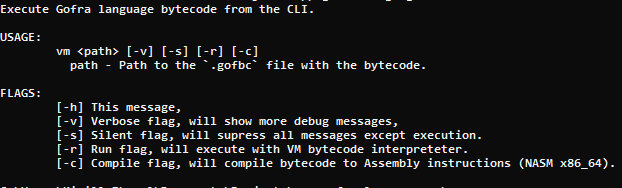

# Gofra virtual machine.
There is internal interpretator in Gofra-Lang core, bytecode for now not have some major thigs.
*****

## Features
- Execute (interpretate) `.gofbc` bytecode file.
- Compile `.gofbc` bytecode file to assembly file (NASM x86_64) `.asm`

## How to get bytecode.
Bytecode compiled via Gofra-Lang core. Gorfa bytecode files have extension `.gofbc`. 

*****
## Preview

